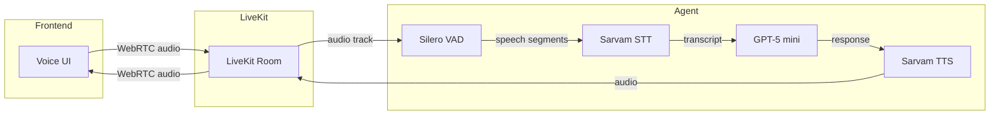

# Voice Agent Architecture

## Overview
Real-time voice assistant using LiveKit Agents framework with Sarvam AI (STT/TTS) and OpenAI GPT-5 mini (LLM).

---

## Tech Stack

| Layer | Technology | Role |
|-------|------------|------|
| Transport | LiveKit (WebRTC) | Real-time audio streaming |
| STT | Sarvam AI (WebSocket) | Speech-to-text |
| VAD | Silero VAD | Voice activity detection |
| LLM | OpenAI GPT-5 mini | Conversation |
| TTS | Sarvam AI (WebSocket) | Text-to-speech |
| Backend | Python + livekit-agents | Agent orchestration |
| Frontend | Next.js + @livekit/components-react | Voice UI |

---

## Architecture Flow



---

## Folder Structure

```
├── backend/
│   ├── agent/
│   │   ├── __init__.py
│   │   ├── main.py              # Agent entry, VoicePipelineAgent setup
│   │   └── prompts.py           # System prompts for LLM
│   │
│   ├── plugins/
│   │   ├── __init__.py
│   │   ├── sarvam_stt.py        # Sarvam STT plugin (streaming WebSocket)
│   │   └── sarvam_tts.py        # Sarvam TTS plugin (streaming WebSocket)
│   │
│   ├── api/
│   │   ├── __init__.py
│   │   └── token.py             # LiveKit token generation endpoint
│   │
│   ├── config/
│   │   └── settings.py          # Pydantic settings from env
│   │
│   ├── requirements.txt
│   ├── .env.example
│   └── README.md
│
├── frontend/
│   ├── app/
│   │   ├── page.tsx             # Main voice UI page
│   │   ├── layout.tsx           # Root layout
│   │   └── api/
│   │       └── token/route.ts   # Proxy to backend token endpoint
│   │
│   ├── components/
│   │   ├── VoiceAgent.tsx       # Main voice component
│   │   ├── AudioVisualizer.tsx  # Audio waveform display
│   │   └── ConnectionStatus.tsx # Connection state indicator
│   │
│   ├── lib/
│   │   └── livekit.ts           # LiveKit client config
│   │
│   ├── package.json
│   ├── .env.local.example
│   └── README.md
│
└── doc/
    └── Architecture/
```

---

## Component Details

### Backend

| Component | File | Responsibility |
|-----------|------|----------------|
| **Agent Entry** | `agent/main.py` | Initialize `VoicePipelineAgent` with STT, LLM, TTS plugins |
| **Sarvam STT Plugin** | `plugins/sarvam_stt.py` | Implement `livekit.agents.stt.STT` interface using Sarvam WebSocket |
| **Sarvam TTS Plugin** | `plugins/sarvam_tts.py` | Implement `livekit.agents.tts.TTS` interface using Sarvam WebSocket |
| **Token API** | `api/token.py` | Generate LiveKit JWT tokens for room access |
| **Config** | `config/settings.py` | Load API keys, URLs from environment |

### Frontend

| Component | File | Responsibility |
|-----------|------|----------------|
| **Voice UI** | `app/page.tsx` | Connect to LiveKit room, render voice interface |
| **VoiceAgent** | `components/VoiceAgent.tsx` | Mic control, LiveKit hooks integration |
| **Visualizer** | `components/AudioVisualizer.tsx` | Display audio levels/waveform |
| **Token Route** | `app/api/token/route.ts` | Fetch token from backend |

---

## Data Flow (Step by Step)

```
1. User clicks "Start" → Frontend requests token from backend
2. Frontend connects to LiveKit room with token
3. User speaks → Browser captures audio via WebRTC
4. Audio streams to LiveKit → Agent receives audio track
5. Silero VAD detects speech segments → triggers STT
6. Sarvam STT (WebSocket) → converts audio to text
7. Text sent to GPT-5 mini → generates response
8. Response sent to Sarvam TTS (WebSocket) → generates audio
9. Audio published to LiveKit room → streams to frontend
10. Frontend plays audio response
```

---

## Key LiveKit Concepts

| Concept | Description |
|---------|-------------|
| **Room** | Virtual space where participants connect |
| **Track** | Audio/video stream (publish/subscribe) |
| **VoicePipelineAgent** | Orchestrates STT → LLM → TTS flow |
| **VAD** | Detects when user starts/stops speaking |
| **Turn Detection** | Knows when to respond vs wait |

---

## Environment Variables

### Backend `.env`
```
LIVEKIT_URL=wss://your-app.livekit.cloud
LIVEKIT_API_KEY=
LIVEKIT_API_SECRET=
SARVAM_API_KEY=
OPENAI_API_KEY=
```

### Frontend `.env.local`
```
NEXT_PUBLIC_LIVEKIT_URL=wss://your-app.livekit.cloud
NEXT_PUBLIC_BACKEND_URL=http://localhost:8000
```

---

## Dependencies

### Backend (`requirements.txt`)
```
livekit-agents>=0.12
livekit-plugins-openai
livekit-plugins-silero
openai
websockets
pydantic-settings
fastapi
uvicorn
```

### Frontend (`package.json`)
```
@livekit/components-react
livekit-client
next
react
```
